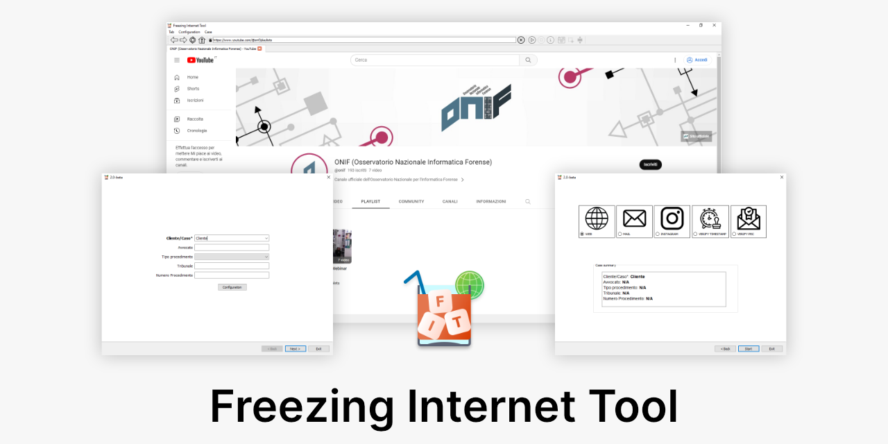

# FIT – Freezing Internet Tool

**FIT** is a modular suite of Python applications for digital forensic acquisition of online contents such as web pages, emails, social media, and more. Each module can run independently or as part of the full FIT suite.

The project is based on the [final exam](https://github.com/zitelog/fit) by **Fabio Zito (@zitelog)** for the Master's program in **Cybersecurity, Digital Forensics, and Data Protection**.

---

## Technologies Used
- **MVC Pattern** for design
- **Python** as the programming language
- **[Qt](https://www.qt.io/download-open-source)** for the graphical user interface and Web Engine
- **Scapy** for network traffic capture
- **[Qt Multimedia](https://doc.qt.io/qt-6/qtmultimedia-index.html)** for screen video and audio recording
  - More information about audio recording [here](https://github.com/fit-project/fit/wiki/Screen-recording-audio-management)
- **SQLite and SQLAlchemy** for data management

---

## Prerequisites
Before installing FIT, make sure you have the following dependencies installed:

- **[FFmpeg](https://ffmpeg.org/download.html)** (required for screen recording and media processing)
- **[NPCAP](https://npcap.com/dist/)** (required only for Windows, to capture network traffic and execute traceroute)  
  **Note:** Do not install WinPCAP as it is deprecated.

---

## What’s new in 3.0.0

Starting from **v3.0.0**, FIT becomes a **bundle/launcher**. Each acquisition module lives in its own repository and can be installed or updated independently.

### External Modules (installed via Poetry Git dependencies)
- **fit-wizard** – guided flow and common UI
- **fit-web** – generic web acquisitions
- **fit-mail** – email acquisitions
- **fit-instagram** – Instagram acquisitions
- **fit-video** – Video acquisitions
- **fit-entire_website** – Whole-site acquisitions

This modular architecture allows investigators to:
- Install only the required modules.
- Update each module independently.
- Develop, test, and release modules on separate timelines.

---

## Installation (Bundle)

```bash
git clone https://github.com/fit-project/fit.git
cd fit
pip install poetry
poetry install
poetry run python fit.py
```

---

## Installation (Single Module)

Each module can be installed as a standalone package. For example:

```bash
pip install poetry
poetry add git+https://github.com/fit-project/fit-web.git@main
```

---

## Contributing
1. Fork this repository.  
2. Create a new branch (`git checkout -b feat/my-feature`).  
3. Commit your changes using [Conventional Commits](https://www.conventionalcommits.org/en/v1.0.0/).  
4. Submit a Pull Request describing your modification.

---